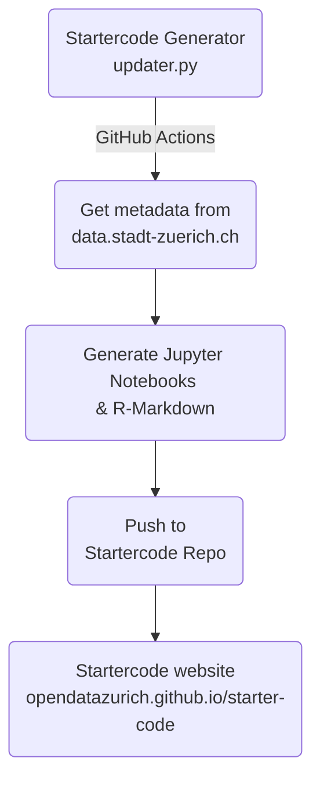
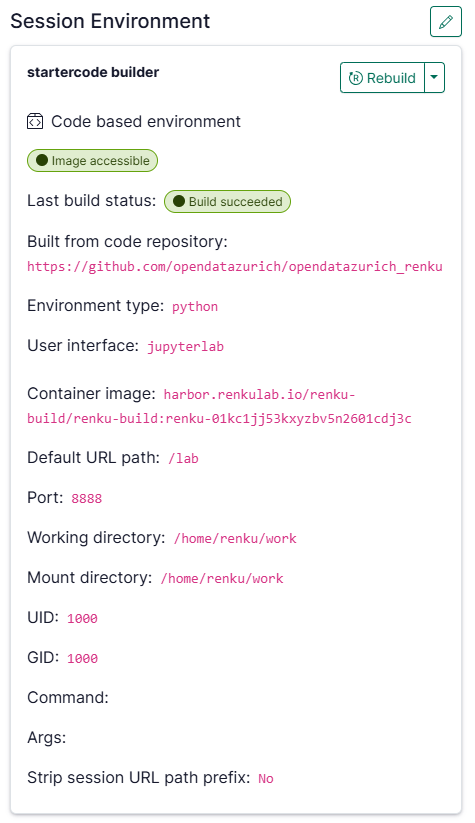
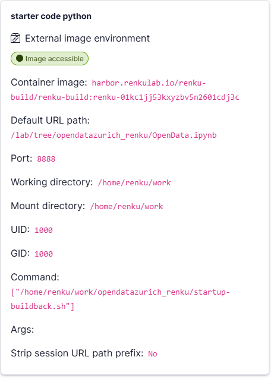
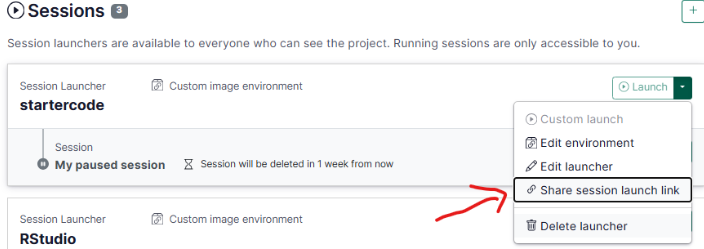
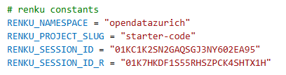
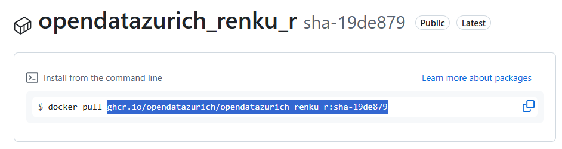
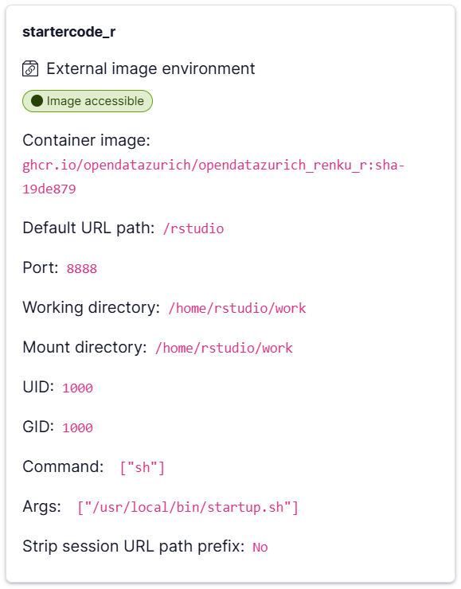

# 🚀 Starter Code Generator for OpenDataZurich

### Automatically generate Python and R starter code for the https://data.stadt-zuerich.ch/ platform


## Overview
This repo provides a Python script that generates starter code notebooks from a metadata JSON of open data catalogue. You can execute the script manually or trigger it regularly (e.g. every night) with a GitHub Action that we provide here too and by that create code notebooks for every dataset in your data catalogue. 

The script also generates a README file that contains a list of all datasets and links to the corresponding notebooks that you can use as an overview for your users. You can expose this easily as a website with GitHub Pages.

The execution of the script is lightweight and takes only a couple of minutes depending on the count of datasets in your data portal.

Your users get notebooks that are specifically tailored for every dataset. They are already set with the most recent data set metadata and code snippets. Your user can start their analysis for your data sets right away with just a couple of clicks or even just one single click if they use Google Colab.

This repo here is setup so that it generates the starter code [in this repo](https://github.com/opendatazurich/starter-code) and creates [this overview page here](https://opendatazurich.github.io/starter-code).


## How does it work?
The system works with two repos. 
- The **first repo** contains the code from this repo here that creates the notebooks and the overview README. 
- The GitHub Action workflow included in this repo instantiates a container, installs the necessary dependencies, clones the repo, and executes the script. 
- Once the notebooks are created the workflow will push these to a **second repo** that you can make available for your users.

The script works with templates that are stored in – you guessed it – `_templates`. You easily can adapt these according to your ideas. Just make sure that you keep the necessary placeholders (marked with double curly brackets) in the templates. The script will replace them with values from the metadata JSON.

The code works out of the box with the [metadata API of data.stadt-zuerich.ch](https://data.stadt-zuerich.ch/api/3/action/current_package_list_with_resources). 

Here's an overview:



## How to adapt the code to your needs?
-   Clone this repo and commit/push it to your GitHub account.
-   Create a second repo where you want to store the results.
-   Adapt the constants in `updater.py` to your account information, repo names, etc.
-   Adapt the parsing functions in `updater.py` to your metadata API.
-   Adapt the workflow file (see `.github/workflows/autoupdater.yml`):
    -   Set the cron pattern.
    -   Set the values for `destination-github-username` (the name of your GitHub account) and `destination-repository-name` (the name of the mentioned second repo that receives the results).
-   In your GitHub account go to `Settings > Developer settings > Personal access tokens > Fine-grained tokens` and create a new token by clicking `Generate new token`.
    -   Set a token name and set the expiration.
    -   Set `Repository access` to `Only select repositories`. Select both repositories and set permissions to `Read access to metadata` and `Read and Write access to code`.
    -   Copy the token.
-   In your GitHub account go to `Settings > Secrets` and create a new secret by clicking `New repository secret`.
    -   Set the name to `PAT` and paste the token you just copied. If you name your secret differently you need to adapt the workflow file accordingly.
-   Manually trigger the GitHub Action workflow and check the results.
-   Do not forget to add a license to your second repo.

## User-Agent

All HTTP requests carry a custom `User-Agent` header so that traffic from the generator and from generated notebooks can be identified in the data portal access logs. Three values are defined as constants at the top of [updater.py](updater.py) — adjust them if you fork this project:

- `USER_AGENT_GENERATOR` — used by `updater.py` itself when fetching the CKAN catalogue.
- `USER_AGENT_NOTEBOOK_PY` / `USER_AGENT_NOTEBOOK_R` — substituted into the `{{ USER_AGENT }}` placeholder when notebooks are rendered, so Python and R notebook traffic is distinguishable.

The format follows RFC 7231: `Product/Version (comment)`, with a `+URL` pointing back to the source repo. Bump the version when you change request behaviour in a way operators of the data portal might care about.

How it gets applied in the generated notebooks:

- **Python (tabular)**: passed as `storage_options={"User-Agent": ...}` to `pd.read_csv` / `pd.read_parquet` (uses fsspec for HTTP fetches).
- **Python (geo)**: passed as `headers=` to the `requests.get` calls against the WFS endpoint.
- **R (tabular)**: set globally via `options(HTTPUserAgent = ...)`, which curl-based readers (readr, arrow) pick up.
- **R (geo)**: same `options()` call plus `Sys.setenv(GDAL_HTTP_USERAGENT = ...)` (for `sf::st_read`, which fetches via GDAL/vsicurl) and an explicit `req_user_agent()` on the httr2 pipeline.

## Dependencies

The repository contains an ```environment.yml``` and an ```requirements.txt``` file,
which can be utilized by
[conda](https://docs.conda.io/projects/conda/en/stable/user-guide/install/index.html)
or pip. To use conda to install the dependencies do the following:

```bash
# To create the environment:
conda env create --file environment.yml

# To activate the environment:
conda activate opendatazurich

# To update the environment after change of the environment.yml
conda env update --file environment.yml  --prune

# To delete the environment:
conda remove --name opendatazurich --all
```

## Setup for Renku

This starter code setup uses [renku](https://renkulab.io/) to provide free access to online analysis in Python and R. To make this available to all users without requiring them to create an account, you need to set up custom launchers in renku. 

> Note: At OpenDataZurich, we use custom launchers with specifically built containers to fit our needs. If you don't use the functionality for geo datasets you might not need this. In that case you can simply use a [launcher with one of the prebuilt environments](https://docs.renkulab.io/en/latest/docs/users/getting-started/launch-session) from renku.

### Python Launcher

To fully recreate the Python project you need 4 things:

1. **[Github Repo](https://github.com/opendatazurich/opendatazurich_renku)**: This repo contains the necessary information to build a container that can be used in renku. It also contains a Github Actions Workflow that builds the container on Github. We do not use the later anymore. Instead we build the container in renku because it reduces the start up time.

2. **[Renku "startercode builder"](https://renkulab.io/p/opendatazurich/starter-code#launcher-01KC1JJ533HN1HVJX3FTBZYTXJ)**: To build an store the container in renku from the Github repo, you need a separate launcher of the type **Create from code**. Here are the settings for the builder: <BR>  You will have to change the **Build from code repository** URL, if you want to use your own custom container. The **Container Image** URL will be available, as soon as the build is finished.

3. **Renku Session Launcher ["starter code python"](https://renkulab.io/p/opendatazurich/starter-code#launcher-01KC1K2SN2GAQSGJ3NY602EA95)**: To start the container you need to create one more launcher with an **External environment**. Most importantly you will need to copy the **Container image** URL from the builder and use it here. You also need to set the environment variables `PACKAGE_ID` and `RESOURCE_ID`. Set both of them to `NONE`. The remaining parameters are as follows:<BR>   

4. **Renku Session ID**: Once your launcher is configured, you can copy the launcher ID, for example by clicking on **Share session launch link**: <BR>  The session ID is the part between `sessions/` and `/start` and looks for example like this `01JZT3TY89P6YRMMJXV9PEDQZW`. Insert this ID as the constant `RENKU_SESSION_ID` in to [updater.py](updater.py):<BR>  

### R Launcher

The setup for the R-Launcher is similar, but a little simpler than the Python setup. You need:

1. **[Github Repo](https://github.com/opendatazurich/opendatazurich_renku_r)**: This repo contains the necessary information to build a container that can be used in renku. It also contains a Github Actions Workflow that builds the container on Github. You can fork the repo, and Github will build the container automatically. Make sure that the container package is **public**. Once the container is built, you can copy the latest container url from the package page: https://github.com/opendatazurich/opendatazurich_renku_r/pkgs/container/opendatazurich_renku_r 

2. **Renku Session Launcher ["startercode_r"](https://renkulab.io/p/opendatazurich/starter-code#launcher-01K7HKDF1S55RHSZPCK4SHTX1H)**: Create a new session launcher in renku with an **External environment**. Most importantly you will need to copy the **Container image** URL from Github and use it here. You also need to set the environment variables `PACKAGE_ID` and `RESOURCE_ID`. Set both of them to `NONE`. The remaining parameters are as follows:<BR>  

3. **Renku Session ID**: When your launcher is configured, you can copy the launcher ID, for example by clicking on **Share session launch link**: <BR>  The session ID is the part between `sessions/` and `/start` and looks for example like this `01JZT3TY89P6YRMMJXV9PEDQZW`. Insert the ID as the constant `RENKU_SESSION_ID_R` in to [updater.py](updater.py):<BR>  


## Good to know
- [Patrick](https://github.com/rnckp)'s code for opendata.swiss, which can be found [here](https://github.com/rnckp/starter-code-opendataswiss-gh), served as a template for this project. Thank you very much for the feedback and useful tips!
- The Team Data of the Statistical Office of the Canton Zürich use the same code and workflow [here](https://github.com/openZH/startercode-generator_openZH).
- The wonderful people of the [OGD team Thurgau](https://ogd.tg.ch/) have created a [similar project](https://github.com/ogdtg/starter-code-ogdtg).


## Collaboration
Your ideas and contributions are very welcome. Please open an issue or a pull request.
